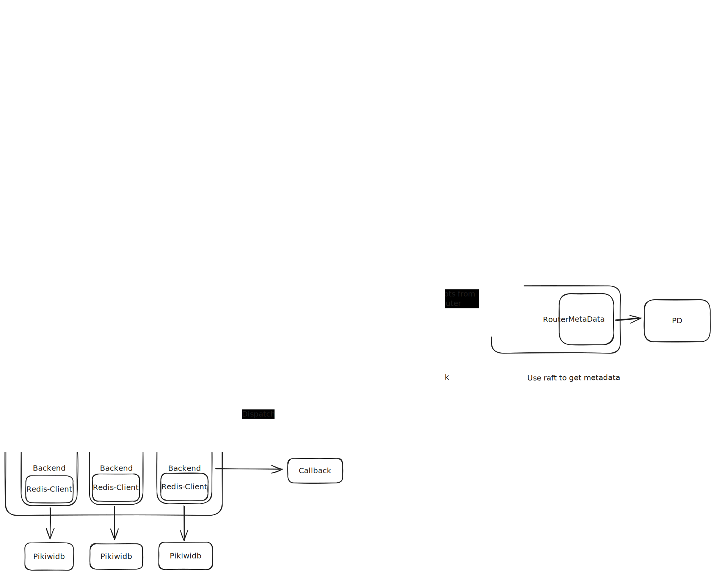

# PikaProxy_zh

## 背景

随着 pikiwidb 的发展, 单机 pikiwidb 的性能将会达到瓶颈, 支持集群化的功能以增强其横向拓展的能力。在调研了几款主流的 redis proxy 在 pikiwidb 的使用场景下的优劣后, 发现他们有如下劣势:

- twemproxy
    作为twitter开源的一款基于C语言的redis代理, twemproxy 是早期使用比较多的一款 proxy, 但是他存在的缺点有:
    1. 使用一致性 hash 算法进行 slot 槽位的划分, 面对在线扩容的场景不友好;
    2. 使用 C 语言进行开发, 二开纳入 pikiwidb 主库的成本比较高, 无法享受到pikiwidb代码库中的基础库改造带来的性能提升;
    3. pikiwidb 的分组 raft 需要额外引入 PD 组件进行元数据的管理, twemproxy 不具备与 PD 交互的能力, 额外引入交互模块需要对原有架构进行改造, 成本较高;

- codis
    codis 是豌豆荚开源的一款 redis 代理, 相比 twemproxy 具备在线扩容的能力, 同时集成了 dashboard, admin 等工具方便运维, 但是同时也有如下缺点:
    1. Go 语言实现, proxy 属于 CPU 密集型系统, 使用 Go 语言实现会因为GC带来的损耗一定程度上降低性能;
    2. codis 中对 redis-client 以及后端 redis 均进行了一定改造, 如果 pikiwidb 想要持续维护基于 codis 的集群, 需要做对应适配, 同时当前 codis 代码基于 go1.8, 当时 go 语言版本包管理系统等都不够完善, 导致现在 codis 的维护相对麻烦;
    3. 同 twemproxy 中 3, 需要自研额外支持 Muilt-Raft MetaData 模块;

基于与以上系统的对比, 我们决定自行设计 pikiwidb-cluster 模式, 并将 proxy 作为一个独立模块自研引入。

## 整体设计

### 整体架构图

PikaProxy 的整体架构如图所示, 其系统核心包含以下几个模块:

- Listener
    Listener 为一个轻量级模块, 基于 pikiwidb 中已有的网络库实现, 使用一个 EventLoop 对本地 xxxx端口(待定) 进行监听。当监听到 client 端的链接请求后, 会为对应的客户端生成一个 Client 的结构, 用于维护和客户端之间的长连接, 同时对客户端命令做 dispatch。
- WorkerManager
    WorkerManager 是进行实际工作的管理员, 允许通过配置在 Proxy 启动时开启指定数量的 Worker, Worker 中的运行实例被命名为 Task。Task实例将会执行如下操作:
    1. 对网络包进行处理, 基于 pikiwidb 已有的 resp 协议解析模块, 将网络流解析为 Resp 结构体;
    2. 对 Resp 结构的 key 进行处理, 基于 Router 中的信息将 Resp 包装为对应的 Task, 同时构造好回调函数, 然后将这些 Task 放入对应 Backend 的队列中
- Router
    Router 负责进行命令的路由, 整体设计为一个 Interface。PikaProxy目前计划设计两种 Router:
    1. 使用一致性hash或者 codis 中的 shared分片模式, 抛开对 PD 的依赖, 支持单机 pikiwidb 集群模式(第一版本考虑实现);
    2. 以 learner 模式加入 PD 构建的 raft 集群中, 基于 raft 同步 raft 集群元信息, 并基于集群的元信息判断对应的 key 所属的 pikiwidb 实例, 进行路由转发;
- BackendManager
    BackendManager 负责对所有的 Backend 进行管理, 其中每个 Backend 唯一代表了与后端一个 pikiwidb 的链接, Backend 需要基于 gRPC 的 Redis协议模块, 实现一个简易的 redis-client 模块。
    每个 redis-client 模块需要维护一个属于自己的任务队列, 同时通过挂起任务对任务队列进行轮询, 批量对 RedisTasks 进行处理, 可以参考 [brpc实现的redis-client](https://brpc.apache.org/docs/client/access-redis/) 进行实现, 要求支持 Batch 化处理, assigned to: @hky

## 整体 IO 路径

1. client 发起建立链接的请求, proxy 上的 Listener 收到建链请求, 会为该 client 生成一个 Client 结构体;
2. client 发起一个请求, proxy 端的 Client 拿到请求信息以后, 将请求信息封装入 Task 中, 将 Task 放入 WorkerPool;
3. WorkerPool 轮询请求, 针对不同的请求类型, 将请求转换为对应的 Resp 结构, 并对该结构进行路由, 将请求路由到对应的 backend 中(针对 mset/mget 类的请求需要对回调方案进行额外处理);
4. 每一个 backend 会维护一个自己的任务队列, 同时挂起轮询, 对任务队列分 Batch 进行处理, 通过 callback 处理后端 pikiwidb 返回的信息;

### get/set/delete

### mget/mset

## 错误处理

## RoadMap
